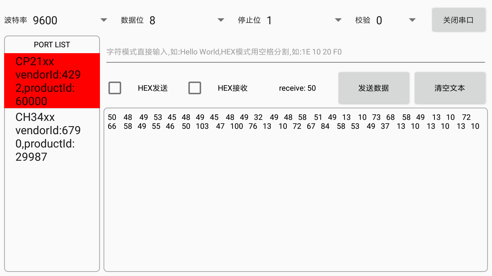
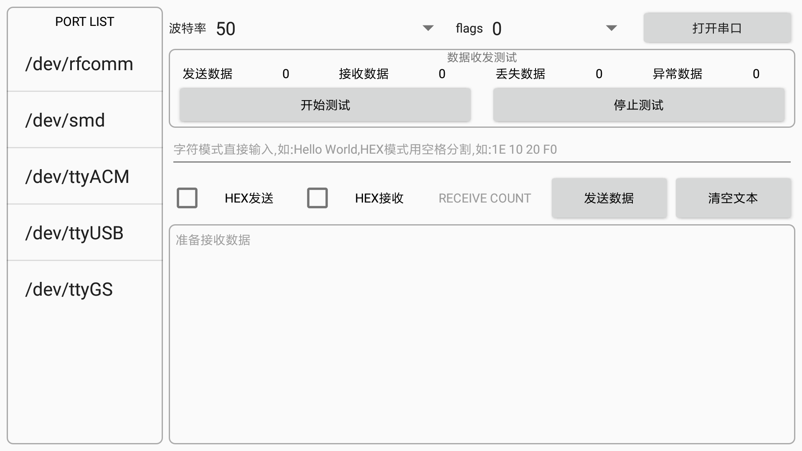

## 本工程是基于[usb-with-serial-port](https://github.com/HelloHuDi/usb-with-serial-port)开发的简单调试工具.

## [download apk](https://raw.githubusercontent.com/HelloHuDi/usbSerialPortTools/master/app/release/app-release.apk)

## support android sdk version 19+

## screenshot：

